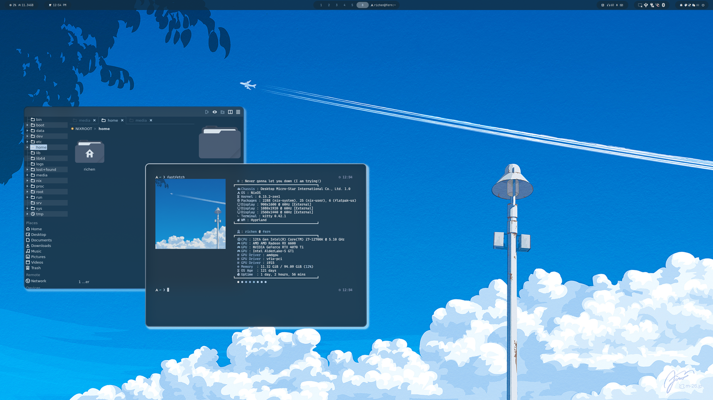

# richendots 🌿

my personal dotfiles from the flake template of [hydenix](https://github.com/richen604/hydenix)

some modules are specific to my system, feel free to use what you can as a reference.



## structure 📁

quick overview of my modules:

```bash
├── src/
│   ├── misc/                                 # i put files for `home.file` calls here
│   ├── modules/
│   │   ├── hm/                               # home manager modules
│   │   │   ├── dev.nix
│   │   │   ├── easyeffects.nix
│   │   │   ├── expo-dev.nix
│   │   │   ├── games.nix
│   │   │   ├── obs.nix
│   │   │   └── zsh.nix
│   │   └── system/                           # system modules
│   │       ├── vfio/                         # vfio modules for pci passthrough
│   │       │   ├── scripts/                  # useful scripts and files for vfio passthrough
│   │       │   └── vfio.nix
│   │       ├── autologin.nix
│   │       ├── gamescope.nix
│   │       ├── linux-cachyos.nix             # cachyos linux kernel
│   │       ├── plex.nix
│   │       ├── steam.nix
│   │       ├── sunshine.nix
│   │       └── wol.nix
│   ├── configuration.nix                      # main configuration file
│   └── home.nix                               # main home manager configuration file
├── config.nix                                 # hydenix config file
├── flake.nix
└── hardware-configuration.nix
```

## TODO

- [ ] multi system for other hosts (laptop, desktop, vm, install liveusbs, etc)
  - Host naming scheme:
    - 🌿 Desktop: fern
    - 🌱 Laptop: moss
    - 🪵 Server: cedar
    - 🌱 Live USB OS: sapling
    - 🍀 Main VM: clover
    - Install USBs: [hostname]-seed (fern-seed, moss-seed, cedar-seed)
    - VMs: [hostname]-vm (fern-vm, moss-vm, cedar-vm)
- [ ] fix "reboot-to" script, grub-reboot has issues
- [ ] cleanup generic modules in home.nix and configuration.nix

## license 📄

this project is licensed under the GPL-3.0 License - see the [LICENSE](LICENSE) file for details
