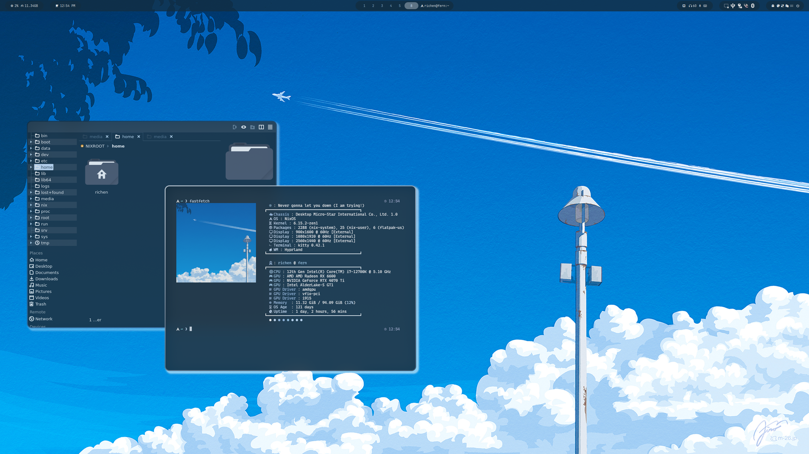

</img>

# richendots - the grove

my personal nixos config

---

---

- **bar** - [`waybar`](./wrappers/waybar.nix)
- **app launcher / clipboard** - [`vicinae`](./wrappers/_vicinae.nix)
- **browser** - `glide (firefox)` [grove theme](./wrappers/glide/userChrome.css)
- **spotify** - [`spicetify-tui`](./profiles/gui/hjem/config/spicetify/Themes/tui/user.css)
- **discord** - [`equibop`](./profiles/gui/packages.nix) + [grove theme](./profiles/gui/hjem/config/equibop/system24-grove.css)
- **file manager** - [`yazi`](./wrappers/yazi.nix)
- **editor** - [`doom emacs`](./wrappers/doom-emacs/doom.d/config.el)
- **terminal** - [`kitty`](./wrappers/kitty.nix)
- **shell** - [`zsh`](./wrappers/zsh/default.nix)
- **notifications** - [`swaync`](./wrappers/swaync.nix)
- **cursor** - [`Bibata-Modern-Ice`](./profiles/gui/theme.nix)
- **font** - [`GohuFont Nerd Font`](./profiles/common/fonts.nix)
- **gtk** - [`catppuccin-mocha-green-compact`](./profiles/gui/theme.nix)
- **icon** - [`Papirus Dark`](./profiles/gui/theme.nix)

## features

- `3.7s` eval (on my machine)
- multi host & single user
- profiles (common, desktop, laptop, server)
- 3 hosts
  - fern - desktop 🌿
  - oak - laptop 🌳
  - cedar - server 🪵

> [!TIP]
> some modules, packages, and options are obfuscated from private imports  
> the configuration will not build from a clone/fork without [`inputs.richendots-private`](./lib/hosts.nix#L46-L58) removed

## license

MIT unless otherwise noted. See [`THIRD_PARTY_LICENSES.md`](./THIRD_PARTY_LICENSES.md) for third-party license exceptions.
