# TODO

## richendots private modules [private]

### security.references

- [ ] read [The Practical Linux Hardening Guide](https://github.com/trimstray/the-practical-linux-hardening-guide) and take notes

### security.sops [private]

General TODO:

1. Initial Setup

- [x] buy usbs for backups
- [ ] Generate age keys for fern first

  ```bash
  # Create directories
  mkdir -p ~/.config/sops/age/fern
  mkdir -p ~/.ssh

  # Generate age keys for fern
  age-keygen -o ~/.config/sops/age/fern/keys.txt
  age-keygen -y ~/.config/sops/age/fern/keys.txt > ~/.config/sops/age/fern/keys.pub
  
  # Set proper permissions
  chmod 600 ~/.config/sops/age/fern/keys.txt
  chmod 644 ~/.config/sops/age/fern/keys.pub

  # Generate SSH keys for fern
  ssh-keygen -t ed25519 -C "fern@$(hostname)" -f ~/.ssh/id_ed25519_fern
  chmod 600 ~/.ssh/id_ed25519_fern
  chmod 644 ~/.ssh/id_ed25519_fern.pub
  ```

2. YubiKey Configuration

- [ ] YubiKey Integration
  - [x] Purchase security key(s)
    - [x] Primary YubiKey
    - [ ] Backup YubiKey (for secure storage)
  - [ ] Initial YubiKey Setup

    ```bash
    # Primary YubiKey
    age-plugin-yubikey generate
    # Save the output (age1yubikey1q...) for sops.yaml

    # Backup YubiKey
    age-plugin-yubikey generate
    # Save the output (age1yubikey2q...) for sops.yaml

    # Test YubiKeys
    age-plugin-yubikey list
    ```

  - [ ] Document YubiKey PINs in system KeePassXC

3. KeePassXC Setup

- [ ] Init System KeePassXC database

  ```bash
  # Create directories for KeePassXC
  mkdir -p ~/.local/share/keepassxc
  
  # Create new database (GUI required)
  keepassxc
  # File -> New Database -> Follow wizard
  # Save as system.kdbx
  ```

- [ ] setup "richen" keepassxc

  ```bash
  # Configure YubiKey for Challenge-Response
  ykman oath accounts uri # Verify OATH is available
  ykman config usb --enable-all # Enable all USB interfaces if needed
  
  # Create user database with enhanced security
  keepassxc
  # File -> New Database -> Follow wizard
  # Save as richen.kdbx
  # In Database Settings:
  # 1. Set strong master password
  # 2. Enable YubiKey Challenge-Response for 2FA on password entries
  ```

  - [ ] replace all passwords
  - [ ] Configure authentication methods for password entries:
    - Master password only for database access
    - YubiKey Challenge-Response as 2FA for critical passwords
    - Store backup YubiKey Challenge-Response in system.kdbx
- [ ] Add both fern keys to System KeePassXC database backup
  - Import Age keys from ~/.config/sops/age/fern/
  - Import SSH keys from ~/.ssh/id_ed25519_fern*

4. Private Repository Setup

- [ ] init private secrets repository

  ```bash
  # Clone and setup private repo
  git clone git@github.com:richen604/richendots-private.git
  cd richendots-private
  
  # Initialize repository structure
  mkdir -p secrets/{admin,fern,users/richen}
  
  # Create initial flake.nix
  cat > flake.nix << 'EOF'
  {
    description = "Private secrets management";
    inputs = {
      nixpkgs.url = "github:nixos/nixpkgs/nixos-unstable";
      sops-nix.url = "github:Mic92/sops-nix";
    };
    # ... complete this based on your needs ...
  }
  EOF
  ```

  - [ ] Document usage and structure from [security.docs](#securitydocs-private)
  - [ ] Create reusable sops-nix modules for secret management

5. SOPS Configuration

- [ ] Secret & Module Discovery
  - [ ] Audit authentication needs:

    ```yaml
    # Authentication Inventory
    system:
      ssh:
        type: system-secret
        access: root
        format: yaml
        location: secrets/fern/ssh.yaml
    user:
      ssh:
        type: user-secret
        access: richen
        format: yaml
        location: secrets/users/richen/ssh-keys.yaml
    services:
      syncthing:
        type: service-secret
        access: service
        format: yaml
        location: secrets/fern/services/syncthing.yaml
    ```
  
  - [ ] Create nix modules for each secret

  - [ ] Document access patterns:
    - System-level secrets (root only)
    - User-specific secrets
    - Service credentials
    - Backup requirements
    - Recovery procedures

- [ ] Setup sops.yaml

  ```yaml
  keys:
  - &admin_primary age1yubikey1q...  # Primary YubiKey (from step 2)
  - &admin_backup age1yubikey2q...   # Backup YubiKey (from step 2) 
  - &fern age1xyz...             # System key (from step 1)
  - &richen age1abc...           # User key (generate if needed)

  creation_rules:
  - path_regex: secrets/admin/.*\.yaml$
    key_groups:
    - age:
      - *admin_primary
      - *admin_backup

  - path_regex: secrets/fern/.*\.yaml$
    key_groups:
    - age:
      - *admin_primary
      - *admin_backup
      - *fern

  - path_regex: secrets/users/richen/.*\.yaml$
    key_groups:
    - age:
      - *admin_primary
      - *admin_backup
      - *richen
  ```

- [ ] Configure sops-nix modules

  ```nix
  # hosts/fern/sops.nix
  { config, ... }:
  {
    sops = {
      age.keyFile = "/home/richen/.config/sops/age/fern/keys.txt";
      defaultSopsFile = "/home/richen/richendots-private/secrets/fern/default.yaml";
      secrets = {
        "system/wireless" = {
          sopsFile = "/home/richen/richendots-private/secrets/fern/wireless.yaml";
          mode = "0400";
          owner = "root";
          group = "root";
        };
        "system/certificates" = {
          sopsFile = "/home/richen/richendots-private/secrets/fern/certificates.yaml";
          mode = "0400";
          owner = "root";
          group = "root";
        };
      };
    };
  }

  # home/richen/sops.nix
  { config, ... }:
  {
    sops = {
      age.keyFile = "/home/richen/.config/sops/age/fern/keys.txt";
      defaultSopsFile = "/home/richen/richendots-private/secrets/users/richen/default.yaml";
      secrets = {
        "ssh-keys" = {
          sopsFile = "/home/richen/richendots-private/secrets/users/richen/ssh-keys.yaml";
          mode = "0400";
          owner = "richen";
          group = "users";
        };
      };
    };
  }
  ```

6. Pam Configuration

- [ ] Configure PAM for YubiKey authentication

  ```nix
  # /etc/pam.d/system-auth
  { config, ... }:
  {
    security.pam = {
      services = {
        "system-auth" = {
          text = ''
            # Local login - require YubiKey
            auth [success=1 default=ignore] pam_succeed_if.so service notin ssh* quiet
            auth required pam_yubico.so mode=challenge-response

            # SSH login - rely on SSH key authentication
            auth [success=1 default=ignore] pam_succeed_if.so service in ssh* quiet
            auth sufficient pam_unix.so try_first_pass
          '';
        };
      };
    };
  }
  ```

1. Secret Structure Implementation

- [ ] Setup secrets directory structure and initial secrets

  ```bash
  # Create directory structure
  mkdir -p secrets/{admin,fern,users/richen}
  
  # Create initial secret files
  for dir in admin fern users/richen; do
    sops secrets/$dir/wireless.yaml
    sops secrets/$dir/certificates.yaml
  done
  
  # For user-specific secrets
  sops secrets/users/richen/ssh-keys.yaml
  ```

7. System Integration

- [ ] Configure some nix modules to use sops

  ```bash
  # Add sops-nix to your NixOS configuration
  # In your system's configuration.nix or similar:
  {
    imports = [ 
      sops-nix.nixosModules.sops
    ];
    
    sops.defaultSopsFile = "/path/to/secrets.yaml";
    sops.age.keyFile = "/home/richen/.config/sops/age/fern/keys.txt";
  }
  ```

- [ ] create a keepassxc nixos module

  ```bash
  # Test configuration
  nixos-rebuild test --flake .#fern
  
  # If successful, switch to new configuration
  nixos-rebuild switch --flake .#fern
  ```

8. Verify Setup

```bash
# Test sops encryption/decryption
sops --decrypt secrets/fern/wireless.yaml

# Test YubiKey integration
age-plugin-yubikey list

# Test KeePassXC database access
keepassxc-cli open system.kdbx

# Test full secret retrieval
nix-shell -p sops --run "sops --decrypt secrets/fern/wireless.yaml"
```

### security.docs [private]

Key strategy:

- Two KeePassXC databases
  - system.kdbx: Main system/host keys (age, ssh) and YubiKey PINs
    - Master password unlocked only
    - Contains:
      - System age/ssh keys
      - YubiKey PINs and backup codes
      - LUKS recovery passwords
      - TOTP backup codes for richen.kdbx
    - Access: Rare, administrative backup only
  
  - richen.kdbx: User passwords with multi-factor auth:
    - Master password unlocked only
    - Daily operations eg password 2fa
      - YubiKey Challenge-Response (primary 2FA)
      - TOTP backup (secondary 2FA, codes in system.kdbx)
    - Contains:
      - Web passwords
      - Application credentials
      - Service tokens
      - TOTP seeds for services
    - Access: Regular, daily usage
- USB backups:
  - LUKS encrypted with same master password as system.kdbx
  - Separate USBs for different physical locations
  - Minimum USB size: 32GB
- YubiKey-based authentication:
  - Primary YubiKey: Daily operations (sops, system.kdbx, richen.kbdx, SSH, PAM)
  - Backup YubiKey: Complete duplicate of primary, stored with USB backups
  - Both YubiKeys have their own age identities for sops encryption
- LUKS encryption:
  - Primary password: Stored in system.kdbx, used for daily boot
  - Recovery password: Stored in system.kdbx backup on USB
  - Both passwords should be different from KeePassXC master passwords
  - No automation of LUKS passwords - must be entered manually at boot

Access Control:

- System Keys: Only accessible by admin account
- User Keys: Only accessible by the specific user (richen)
- Critical Secrets: Require both YubiKey and master password
- Access Levels:
  - Admin account: Full system access, used only for administration
  - Richen account: Standard user access, daily operations
  - Service accounts: Limited scope, specific service access only

Usage Guidelines:

- Use admin account only for:
  - System updates
  - Security configuration
  - Key management
  - Emergency procedures
- Use richen account for:
  - Daily work
  - Application usage
  - Non-privileged operations
  - Password management (richen.kdbx)
    - Requires YubiKey Challenge-Response or backup TOTP
    - Master password always required

Backup and Recovery Testing:

1. Quarterly Backup Verification (mark calendar!)
   - Test USB mounting and decryption
   - Verify KeePassXC database access
   - Check key file integrity
   - Test YubiKey operations

2. Simple Recovery Test (twice yearly):
   - Boot from live USB
   - Mount encrypted backup
   - Restore small test secret
   - Verify decryption works

Key backup process:

- System backup: Run `nix run github:richen604/richendots-private#backup -- system`
  - Can also run individually: eg `nix run github:richen604/richendots-private#backup -- system`
  - `system:age` writes `~/.config/sops/age/keys.txt` to the system db then to the usb with known keys by parsing `sops.yaml`
  - `system:ssh` writes `~/.ssh` to the system db then to the usb with known keys by parsing `sops.yaml`
- User backup: Run `nix run github:richen604/richendots-private#backup -- user`
  - copies user db to usb
- Store USB in secure location
- YubiKey backup:
  - Store backup YubiKey in secure location with USB backups
  - Document PINs in system KeePassXC
  - Test backup YubiKey periodically
- Document LUKS passwords in system.kdbx before encrypting drives
- Test both primary and recovery passwords before finalizing setup
- Include LUKS password change procedure in quarterly security review

Key restoration process:

  1. Fresh NixOS install
  2. Restore System KeePassXC backup
    a. Restore SSH keys from backup to ~/.ssh/
    b. Restore age keys from backup to ~/.config/sops/age/keys.txt
    c. Retrieve LUKS passwords from system.kdbx
  3. Set correct permissions on restored keys
    a. `chmod 600 ~/.ssh/id_rsa`
    b. `chmod 600 ~/.config/sops/age/keys.txt`
  4. Mount encrypted drives
    a. Use primary LUKS password from system.kdbx
    b. Test recovery password works but don't use it
    c. Document any password changes in system.kdbx
  5. clone public config
    a. `git clone git@github.com:richen604/richendots.git`
    b. `cd richendots`
    c. `nixos-rebuild switch --flake .#fern`

- Security guidelines:
  - No key syncing between systems
  - System-specific keys only
  - Keep offline backups
  - Private repo for secret modules
  - Public keys in .sops.yaml
  - No secrets in repos
  - Regular key rotation
  - Plan recovery strategy

Emergency Key Revocation Process:

1. Standard Compromise Response:
   - Remove compromised key from .sops.yaml
   - Generate new key for affected system/user
   - Re-encrypt affected secrets
   - Update affected systems
   - Document incident (time, affected keys, actions taken)

2. Critical Security Event (suspected full compromise):

   ```bash
   # Run emergency lockdown script
   nix run github:richen604/richendots-private#emergency-lockdown
   ```

   Script will:
   - Remove age keys: ~/.config/sops/age/keys.txt
   - Remove SSH keys: ~/.ssh/id_*
   - Revoke GitHub SSH access
   - Notify of manual steps needed:
     - Change critical passwords from trusted device
     - Re-generate system keys
     - Re-encrypt secrets

3. YubiKey Compromise:
   - Remove YubiKey's age key from sops.yaml
   - Generate new age identity on backup YubiKey
   - Re-encrypt affected secrets
   - Order replacement YubiKey if physical damage/loss
   - For richen.kdbx access:
     - Use TOTP backup codes from system.kdbx
     - Re-configure Challenge-Response with backup YubiKey
     - Update backup codes in system.kdbx

### future: security [private]

- [ ] Automation and maintenance  
  - [ ] Create key rotation script on private repo
  - [ ] Set up backup automation scripts, copy to usb etc
  - [ ] YubiKey backup testing automation
  - [ ] directory access canary tokens using inotifywait and a watcher service
  - [ ] Configure monitoring for key expiry, probably github actions idk
  - [ ] Implement semi automated emergency key revocation process

- [ ] Advanced Security Hardening (by priority)
  - [ ] WireGuard Host Authentication
    - Setup mesh VPN between hosts for secure communication
    - Pre-shared keys for additional authentication layer
    - Automatic key rotation
    ```nix
    {
      # Example WireGuard configuration (to be implemented)
      networking.wireguard.interfaces = {
        wg0 = {
          ips = [ "10.100.0.1/24" ];
          listenPort = 51820;
          privateKeyFile = "/run/secrets/wireguard/private";
          
          peers = [
            {
              # Oak
              publicKey = "oak-pubkey";
              presharedKeyFile = "/run/secrets/wireguard/psk-oak";
              allowedIPs = [ "10.100.0.2/32" ];
            }
            # Add other hosts...
          ];
        };
      };
    }
    ```

  - [ ] USB Kill Switch & Port Hardening
    - Whitelist-only USB access with YubiKey serials. Implements automatic defensive actions on unauthorized access.
    - Prevents physical attacks while maintaining YubiKey functionality.
    ```nix
    {
      services.usbguard = {
        enable = true;
        rules = ''
          # Whitelist only your YubiKeys by serial
          allow serial "12345-yubikey-primary"
          allow serial "67890-yubikey-backup"
          
          # Block all other USB storage
          block with-interface equals { 08:*:* }
          
          # Kill switch: If unauthorized USB inserted
          # 1. Lock screen
          # 2. Unmount encrypted volumes
          # 3. Log incident
        '';
        implicitPolicyTarget = "block";
        presentDevicePolicy = "apply-policy";
      };
    }
    ```

  - [ ] Canary File System with Dead Man's Switch
    - Active defense system monitoring critical paths with automatic lockdown on unauthorized access.
    - YubiKey-authenticated override prevents false positives.
    ```nix
    {
      systemd.services.canary-watcher = {
        description = "File System Canary Monitor";
        script = ''
          # Watch critical paths with inotifywait
          inotifywait -m -r -e modify,create,delete \
            /home/richen/.ssh \
            /home/richen/.config/sops \
            /etc/nixos | while read path action file; do
            
            # If unexpected changes occur:
            # 1. Alert via matrix/signal
            # 2. Start dead man's switch countdown
            # 3. If not cancelled within 5 minutes:
            #    - Unmount encrypted volumes
            #    - Secure wipe RAM
            #    - Power off system
            
            # Can be cancelled with YubiKey touch
        '';
        serviceConfig = {
          Type = "simple";
          Restart = "always";
        };
      };
    }
    ```

  - [ ] RAM Encryption & Cold Boot Attack Prevention
    - Kernel-level RAM/swap encryption with automatic memory clearing on events.
    - Protects against sophisticated memory-based attacks and cold boot attempts.
    ```nix
    {
      boot = {
        kernelParams = [
          # Encrypt swap and RAM
          "page_poison=1"
          "slub_debug=P"
          # Clear RAM on power events
          "mem_sleep_default=deep"
        ];
        kernel.sysctl = {
          # Prevent memory dumps
          "kernel.core_pattern" = "|/bin/false";
          # Clear caches frequently
          "vm.drop_caches" = 3;
        };
      };
    }
    ```

## richendots public modules [public]

### security.sops [public]

- [ ] Main config integration
  - [ ] Add private repo as flake input (git+ssh)
  - [ ] Import and use sops modules from private repo
  - [ ] NO SOPS CONFIG NEEDED - handled by private modules
  - [ ] Document import patterns and usage

### storage.disko [public]

- [ ] drives (maybe disko)
  - [ ] proper mount points and permissions
  - [ ] automatic mounting
  - [ ] filesystem choices

### storage.backup [public]

- [ ] backups 3-2-1 method
  - [ ] borg
    - [ ] dev directories
    - [ ] important xdg dirs
    - [ ] obsidian vaults

### storage.sync [public]

- [ ] syncthing stuff
  - [ ] per machine 2 way sync enable/disable

### system.boot [public]

- [ ] fix "reboot-to" script, grub-reboot has issues

### system.core [public]

### services.media [public]

- [ ] sonarr/radarr/prowlarr
- [ ] qbitorrent + vpn
- [ ] reverse proxy (?)
- [ ] homarr dashboard

## misc

- [ ] cleanup generic modules in home.nix and configuration.nix
- [ ] prepare for multi system (laptop, desktop, vm, install liveusbs, etc)
- [ ] multi system for other hosts (laptop, desktop, vm, install liveusbs, etc)
  Host naming scheme:
  - 🌿 Desktop: fern
  - 🌳 Laptop: oak
  - 🌲 Media: pine
  - 🪵 Server: cedar
  - 🌱 Live USB OS: sapling
  - 🍀 Main VM: clover
  - Install USBs: [hostname]-seed (fern-seed, oak-seed, cedar-seed)
  - VMs: [hostname]-vm (fern-vm, oak-vm, cedar-vm)
- [ ] use of specializations for some systems
- [ ] impermanence for some systems
- [ ] audit logging (aide, auditd)


## System Architecture Overview 🏗️

```mermaid
graph TB
    %% Styling
    classDef primary fill:#d4ebd0,stroke:#6b9080,stroke-width:2px
    classDef auth fill:#ffedd8,stroke:#f6bd60,stroke-width:2px
    classDef user fill:#e9ecef,stroke:#6c757d,stroke-width:2px
    classDef storage fill:#e9d8a6,stroke:#94d2bd,stroke-width:2px

    %% Authentication Sources
    subgraph AUTH ["Authentication Layer 🔐"]
        direction TB
        YK["🔑 Primary YubiKey"]
        YKB["🔑 Backup YubiKey"]
        KP["🗄️ KeePassXC Databases"]
        USB["💾 Encrypted Backups"]
    end

    %% Host Systems with Individual LUKS
    subgraph HOSTS ["Host Systems 🖥️"]
        direction TB
        subgraph FERN_LUKS ["🌿 Fern LUKS 🔒"]
            FERN["🌿 Fern<br/><small>Desktop Workstation</small>"]
        end
        subgraph OAK_LUKS ["🌳 Oak LUKS 🔒"]
            OAK["🌳 Oak<br/><small>Laptop</small>"]
        end
        subgraph PINE_LUKS ["🌲 Pine LUKS 🔒"]
            PINE["🌲 Pine<br/><small>Media Server</small>"]
        end
        subgraph CEDAR_LUKS ["🪵 Cedar LUKS 🔒"]
            CEDAR["🪵 Cedar<br/><small>Home Server</small>"]
        end
    end

    %% User Layer
    subgraph USERS ["Access Control 👤"]
        direction TB
        RICHEN["👤 Richen<br/><small>Standard User</small>"]
    end

    %% Connections
    YK -->|"Daily Authentication"| HOSTS
    YKB -->|"Backup Recovery"| USB
    KP -->|"Secure Storage"| USB
    RICHEN -->|"Full Access"| FERN & OAK
    RICHEN -.->|"Limited Access"| PINE & CEDAR

    %% Apply styles
    class FERN,OAK,PINE,CEDAR primary
    class YK,YKB,KP,USB auth
    class RICHEN user
    class FERN_LUKS,OAK_LUKS,PINE_LUKS,CEDAR_LUKS storage
```



## Authentication Architecture 🔐

### YubiKey System Design 🔑

```mermaid
graph TB
    %% Styling
    classDef primary fill:#d4ebd0,stroke:#6b9080,stroke-width:2px
    classDef secondary fill:#ffedd8,stroke:#f6bd60,stroke-width:2px
    classDef storage fill:#e9d8a6,stroke:#94d2bd,stroke-width:2px
    classDef host fill:#a8dadc,stroke:#457b9d,stroke-width:2px

    %% Main YubiKey node
    YK[("🔑 YubiKey")]:::primary

    %% Authentication Services
    subgraph AUTH ["Authentication Services"]
        direction TB
        
        subgraph CORE ["Core Authentication"]
            direction TB
            SOPS["🔐 SOPS/Age"]
            SSH["🔑 SSH"]
            PAM["👤 PAM/CR"]
        end

        subgraph PASS_DB ["Password Databases"]
            direction TB
            SYS["💼 system.kdbx<br/>(Master Pass)"]
            USER["👤 richen.kdbx<br/>(Master Pass)"]
            PASS_OPS["🔑 Password Operations<br/>(CR + TOTP Backup)"]
        end

        subgraph HOSTS ["Host Systems"]
            direction TB
            FERN["🌿 Fern"]:::host
            OAK["🌳 Oak"]:::host
            PINE["🌲 Pine"]:::host
            CEDAR["🪵 Cedar"]:::host
        end
    end

    subgraph BACKUP ["Backup & Recovery"]
        direction TB
        BKEY["🔑 Backup YubiKey"]
        USB["💾 USB Backups"]
    end

    %% Core Auth Connections
    YK -->|"age key"| SOPS
    YK -->|"ed25519"| SSH
    YK -->|"challenge-response"| PAM

    %% Password Operations
    YK -->|"challenge-response"| PASS_OPS
    USER -->|"stores passwords"| PASS_OPS
    SYS -->|"stores TOTP backup"| PASS_OPS

    %% Host System Connections
    SOPS -->|"secrets"| HOSTS
    SSH -->|"auth"| HOSTS
    PAM -->|"login"| HOSTS

    %% Backup Connections
    YK -.->|"duplicate"| BKEY
    BKEY -.->|"stored with"| USB

    %% Apply styles
    class AUTH,BACKUP storage
    class SOPS,SSH,PAM secondary
```



Authentication Flows:

```mermaid
flowchart TB
    %% Styling
    classDef primary fill:#d4ebd0,stroke:#6b9080,stroke-width:2px
    classDef flow fill:#ffedd8,stroke:#f6bd60,stroke-width:2px
    classDef backup fill:#e9d8a6,stroke:#94d2bd,stroke-width:2px
    classDef critical fill:#ffd6d6,stroke:#e63946,stroke-width:2px
    classDef warning fill:#fff3b0,stroke:#e09f3e,stroke-width:2px
    classDef recovery fill:#b7e4c7,stroke:#40916c,stroke-width:2px
    classDef system fill:#a8dadc,stroke:#457b9d,stroke-width:2px

    %% Main YubiKey nodes
    YK[("🔑 Primary YubiKey")]:::primary
    BYK[("🔑 Backup YubiKey")]:::backup

    subgraph DAILY ["Daily User Operations"]
        direction TB
        LUKS["🔒 LUKS Disk Encryption<br/>(Password from system.kdbx)"]
        LOGIN["🔐 System Login<br/>(PAM + YubiKey)"]
        USER_DB["👤 richen.kdbx<br/>(YubiKey CR + Master Pass + TOTP)"]
        SECRETS["🗝️ Secrets Access<br/>(age/sops)"]
        GIT["📝 Git Operations<br/>(SSH ed25519)"]
    end

    subgraph ADMIN ["Administrative Tasks"]
        direction TB
        SYS_DB["💼 system.kdbx<br/>(YubiKey CR + Admin Pass)"]
        KEYS["🔑 Key Management<br/>(age + ssh)"]
        USB["💾 USB Backups<br/>(LUKS + system.kdbx)"]
    end

    %% Daily Operation Flows
    YK -->|"Touch"| LOGIN
    YK -->|"Touch + age"| SECRETS
    YK -->|"Touch + CR + Pass"| USER_DB
    YK -->|"Touch"| GIT
    USER_DB -->|"Access"| SECRETS

    %% Admin Operation Flows
    YK -->|"Touch + CR + Admin"| SYS_DB
    SYS_DB -->|"Store"| KEYS
    SYS_DB -->|"Backup to"| USB
    
    %% Backup YubiKey Relations
    BYK -.->|"Duplicate of"| YK
    BYK -->|"Stored with"| USB

    %% Apply styles
    class DAILY,ADMIN flow
```



And here's the dedicated security events graph:

```mermaid
flowchart TB
    %% Styling
    classDef low fill:#d8f3dc,stroke:#40916c,stroke-width:2px
    classDef medium fill:#fff3b0,stroke:#e09f3e,stroke-width:2px
    classDef high fill:#ffd6d6,stroke:#e63946,stroke-width:2px
    classDef system fill:#a8dadc,stroke:#457b9d,stroke-width:2px

    %% Low Severity Events
    subgraph LOW ["🟢 Low Severity - Password/Access Issues"]
        direction TB
        PASS_LEAK["⚠️ Password Leak Detection<br/>(HIBP Integration)"]:::low
        FAILED_LOGIN["❌ Failed Login Attempts<br/>(PAM/SSH)"]:::low
        
        subgraph LOW_RESPONSE ["Response"]
            direction TB
            NOTIFY_USER["📱 Notify User"]:::low
            CHANGE_PASS["🔄 Change Affected Passwords<br/>in richen.kdbx"]:::low
        end
    end

    %% Medium Severity Events
    subgraph MEDIUM ["🟡 Medium Severity - YubiKey/System Access"]
        direction TB
        YUBIKEY_LOST["💳 YubiKey Lost/Stolen"]:::medium
        UNAUTH_ACCESS["🚫 Unauthorized System Access<br/>(File Monitor Alert)"]:::medium
        
        subgraph MED_RESPONSE ["Response"]
            direction TB
            USE_BACKUP_YK["🔑 Switch to Backup YubiKey"]:::medium
            ROTATE_KEYS["🔄 Rotate SSH/Age Keys"]:::medium
            REENCRYPT["🔐 Re-encrypt Affected Secrets"]:::medium
        end
    end

    %% High Severity Events
    subgraph HIGH ["🔴 High Severity - Critical Compromise"]
        direction TB
        BOTH_YK_COMP["⚠️ Both YubiKeys Compromised"]:::high
        SYSTEM_BREACH["🚨 Confirmed System Breach"]:::high
        
        subgraph HIGH_RESPONSE ["Response"]
            direction TB
            LOCKDOWN["🛑 Emergency Lockdown<br/>Remove Keys & Halt"]:::high
            OFFLINE_RESTORE["💾 Offline USB Recovery<br/>system.kdbx + Secrets"]:::high
            FULL_REKEY["🔑 Generate All New Keys<br/>YubiKeys + SSH + Age"]:::high
        end
    end

    %% Flow Connections - Low Severity
    PASS_LEAK & FAILED_LOGIN --> NOTIFY_USER
    NOTIFY_USER --> CHANGE_PASS

    %% Flow Connections - Medium Severity
    YUBIKEY_LOST & UNAUTH_ACCESS --> USE_BACKUP_YK
    USE_BACKUP_YK --> ROTATE_KEYS --> REENCRYPT

    %% Flow Connections - High Severity
    BOTH_YK_COMP & SYSTEM_BREACH --> LOCKDOWN
    LOCKDOWN --> OFFLINE_RESTORE --> FULL_REKEY

    %% Documentation for all levels
    LOG["📝 Incident Log"]:::system
    CHANGE_PASS & REENCRYPT & FULL_REKEY -->|"Document"| LOG
```



### Authentication Workflows

#### 1. Daily System Access & Password Management

```mermaid
%% Daily system access and password management workflow
sequenceDiagram
    participant User as 👤 User
    participant YK as 🔑 YubiKey
    participant LUKS as 🔒 LUKS
    participant Host as 🖥️ Host
    participant UserDB as 📁 richen.kbdx

    Note over User,Host: System Login & Password Access
    User->>LUKS: Enter boot password
    LUKS-->>Host: Decrypt system
    
    User->>Host: Login attempt
    User->>YK: Touch for PAM auth
    YK-->>Host: Verify user
    
    User->>UserDB: Access passwords
    User->>YK: Touch for challenge
    User->>UserDB: Master password
    UserDB-->>User: Grant access
```



#### 2. Administrative & Backup Operations

```mermaid
%% Administrative and backup operations workflow
sequenceDiagram
    participant User as 👤 User
    participant YK as 🔑 YubiKey
    participant Sops as 🔐 sops-nix
    participant SysDB as 🔒 system.kdbx

    Note over User,SysDB: Administrative Tasks
    User->>Sops: Request secret
    User->>YK: Touch for age key
    YK-->>Sops: Authenticate
    Sops-->>User: Decrypt secret

    Note over User,SysDB: System Backup (Rare)
    User->>SysDB: Access system DB
    User->>YK: Touch for challenge
    User->>SysDB: Admin password
    SysDB-->>User: Access backup keys
```



### Common Authentication Scenarios

1. **Daily User Operations**
   - System login (PAM + YubiKey)
   - richen.kbdx access (YubiKey challenge + master password)
   - SSH authentication to hosts
   - Service authentication (passwords + TOTP from richen.kbdx)
   - Non-privileged operations
   - Application usage

2. **Administrative Tasks** 
   - system.kdbx access (YubiKey + admin password)
   - Secrets management with sops-nix
   - System updates and configuration
   - Key management and rotation
   - USB backup verification (quarterly)
   - Recovery testing (twice yearly)
   - Emergency procedures

3. **Security Boundaries**
   - Primary YubiKey: Daily operations, stored securely on person
   - Backup YubiKey: Complete duplicate, stored with USB backups
   - Separate age identities for each YubiKey
   - Critical secrets require both YubiKey and master password
   - No key syncing between systems
   - System-specific keys only

4. **Emergency Procedures**
   - Primary YubiKey compromise: Switch to backup YubiKey
   - Full YubiKey compromise: Run emergency-lockdown script
   - Follow documented recovery process:
     - Remove compromised keys
     - Generate new system keys
     - Re-encrypt affected secrets
     - Update affected systems
     - Document incident details