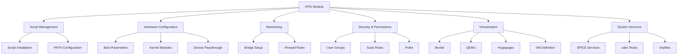

# vfio configuration refactoring plan

## current state analysis

the [`hosts/fern/vfio/default.nix`](hosts/fern/vfio/default.nix:1) configuration is a monolithic 298-line file that handles:
- script installation via activation scripts
- service configuration (spice, udev)
- networking (bridge setup)
- user/group management
- security (polkit, sudo)
- virtualization settings
- boot configuration (kernel params, modules)
- systemd service for VM definition
- package installation

### identified issues

1. **poor organization**: configuration scattered across the file without clear grouping
2. **hardcoded values**: user names, paths, device IDs embedded throughout
3. **repetitive patterns**: script copying/permissions done individually for each script
4. **mixed concerns**: boot, networking, security, and virtualization all intermingled
5. **no abstraction**: configuration is host-specific, not reusable
6. **attr set nesting**: makes related configs harder to co-locate and understand

## proposed structure

### logical configuration groups



## refactoring tasks

### 1. extract configuration into logical groups

reorganize [`default.nix`](hosts/fern/vfio/default.nix:1) into clearly defined sections:

#### a. script management group
- consolidate script installation using `builtins.attrValues`
- use `pkgs.writeShellScriptBin` instead of activation scripts
- leverage `environment.systemPackages` for automatic PATH management

**current approach** (lines 9-41):
```nix
system.activationScripts = {
  postActivation = ''
    mkdir -p /home/richen/.local/bin
    cp -f ${./scripts/vfio.sh} /home/richen/.local/bin/vfio
    # ... repeated for each script
    chown richen:users /home/richen/.local/bin/vfio
    # ... repeated for each script
    chmod +x /home/richen/.local/bin/vfio
    # ... repeated for each script
  '';
};
```

**improved approach** (no IFD, eval-time safe):
```nix
# Script Management
let
  # Define scripts as derivations - no IFD, paths resolved at build time
  vfioScripts = {
    vfio = pkgs.writeShellScriptBin "vfio" (builtins.readFile ./scripts/vfio.sh);
    lg = pkgs.writeShellScriptBin "lg" (builtins.readFile ./scripts/lg.sh);
    start-vfio = pkgs.writeShellScriptBin "start-vfio" (builtins.readFile ./scripts/start-vfio.sh);
    stop-vfio = pkgs.writeShellScriptBin "stop-vfio" (builtins.readFile ./scripts/stop-vfio.sh);
    vm = pkgs.writeShellScriptBin "vm" (builtins.readFile ./scripts/vm.sh);
    rdp = pkgs.writeShellScriptBin "rdp" (builtins.readFile ./scripts/rdp.sh);
  };
  
  vfioScriptPackages = builtins.attrValues vfioScripts;
in {
  environment.systemPackages = vfioScriptPackages;
  
  # Use string interpolation for paths - resolved at build time, not eval time
  security.sudo.extraRules = [{
    groups = [ "wheel" ];
    commands = [
      { command = "${vfioScripts.vfio}/bin/vfio"; options = [ "NOPASSWD" ]; }
      { command = "${vfioScripts.rdp}/bin/rdp"; options = [ "NOPASSWD" ]; }
      { command = "${vfioScripts.vm}/bin/vm"; options = [ "NOPASSWD" ]; }
      { command = "${vfioScripts.lg}/bin/lg"; options = [ "NOPASSWD" ]; }
    ];
  }];
}
```

#### b. hardware configuration group
unpack nested boot attr set for better organization:

**current** (lines 127-194):
```nix
boot = {
  kernelParams = [ ... ];
  kernelModules = [ ... ];
  initrd.kernelModules = [ ... ];
  extraModulePackages = [ ... ];
  blacklistedKernelModules = [ ... ];
  extraModprobeConfig = ''...'';
};
```

**improved**:
```nix
# Hardware Configuration - Boot Parameters
boot.kernelParams = [
  # Memory Management
  "default_hugepagesz=2M"
  "hugepagesz=2M"
  "transparent_hugepage=never"
  
  # Boot Optimization
  "fastboot"
  "quiet"
  "rd.timeout=0"
  "rd.systemd.show_status=false"
  
  # RCU Stall Prevention
  "rcu_nocbs=all"
  "rcu_boost=1"
  "rcu_expedited=1"
  "rcutree.rcu_idle_gp_delay=1"
  
  # IOMMU & VFIO
  "intel_iommu=on"
  "iommu=pt"
  "vfio-pci.ids=10de:2782,10de:22bc"
  
  # KVM Settings
  "kvm.ignore_msrs=1"
  "kvm.report_ignored_msrs=0"
  
  # ACPI & Power Management
  "acpi_osi=Linux"
  "radeon.modeset=0"
];

# Hardware Configuration - Kernel Modules
boot.kernelModules = [
  "vfio_pci"
  "vfio"
  "vfio_iommu_type1"
  "kvmfr"
  "kvm-intel"
  "kvm"
  "amdgpu"
];

boot.initrd.kernelModules = [
  "amdgpu"
  "vfio_pci"
  "vfio"
  "vfio_iommu_type1"
];

boot.extraModulePackages = with config.boot.kernelPackages; [
  kvmfr
];

# Hardware Configuration - Module Blacklist
boot.blacklistedKernelModules = [
  "nouveau"
  "nvidia"
  "nvidia_drm"
  "nvidia_modeset"
  "nvidia_uvm"
];

boot.extraModprobeConfig = ''
  options kvmfr static_size_mb=64
  blacklist nouveau
  options nouveau modeset=0
'';
```

#### c. networking group
keep networking config together but add comments:

```nix
# Networking - Bridge Configuration
networking.interfaces.br0.useDHCP = true;
networking.bridges.br0.interfaces = [ "enp7s0" ];

# Networking - Firewall
networking.firewall = {
  allowedUDPPorts = [ 53 67 ];
  checkReversePath = false;
};

# Networking - NetworkManager
networking.networkmanager.unmanaged = [ "br0" "enp7s0" ];
```

#### d. security & permissions group
consolidate user, group, and permission settings:

```nix
# Security - User Groups
users.users.richen.extraGroups = pkgs.lib.mkAfter [
  "wheel"
  "networkmanager"
  "video"
  "libvirtd"
  "kvm"
  "qemu-libvirtd"
];

users.groups.libvirtd.members = [ "richen" ];
users.groups.kvm.members = [ "richen" ];

# Security - Polkit
security.polkit.enable = true;

# Security - Sudo Rules (defined with scripts above)
```

#### e. virtualization group
unpack virtualisation attr set:

```nix
# Virtualization - Programs
programs.virt-manager.enable = true;

# Virtualization - libvirtd
virtualisation.libvirtd.enable = true;
virtualisation.libvirtd.qemu.swtpm.enable = true;
virtualisation.libvirtd.qemu.runAsRoot = true;
virtualisation.libvirtd.qemu.package = pkgs.qemu_kvm;
virtualisation.libvirtd.qemu.verbatimConfig = ''
  user = "richen"
  group = "kvm"
  cgroup_device_acl = [
    "/dev/null", "/dev/full", "/dev/zero",
    "/dev/random", "/dev/urandom",
    "/dev/ptmx", "/dev/kvm", "/dev/kqemu",
    "/dev/rtc","/dev/hpet", "/dev/sev",
    "/dev/kvmfr0",
    "/dev/vfio/vfio"
  ]
  hugetlbfs_mount = "/dev/hugepages"
  bridge_helper = "/run/wrappers/bin/qemu-bridge-helper"
  memory_backing_dir = "/dev/hugepages"
  cgroup_controllers = [ "memory" ]
'';

# Virtualization - libvirtd Hooks
virtualisation.libvirtd.hooks.qemu = {
  # TODO: figure out the prepare script
  # "prepare" = ./modules/vfio/start.sh;
  # "release" = ./modules/vfio/stop.sh;
};

# Virtualization - SPICE USB Redirection
virtualisation.spiceUSBRedirection.enable = true;

# Virtualization - Hugepages Filesystem
fileSystems."/dev/hugepages" = {
  device = "hugetlbfs";
  fsType = "hugetlbfs";
  options = [ "mode=01770" "gid=kvm" ];
};
```

#### f. system services group

```nix
# System Services - SPICE
services.spice-vdagentd.enable = true;
services.spice-webdavd.enable = true;

# System Services - udev Rules
services.udev.extraRules = ''
  SUBSYSTEM=="kvmfr", OWNER="richen", GROUP="kvm", MODE="0660"
'';

# System Services - tmpfiles
systemd.tmpfiles.rules = [
  "d /dev/hugepages 1770 root kvm -"
  "d /dev/shm 1777 root root -"
  "f /dev/shm/looking-glass 0660 richen kvm -"
];

# System Services - VM Definition
systemd.services.define-win11-vm = {
  description = "Define Windows 11 VM";
  after = [ "libvirtd.service" ];
  requires = [ "libvirtd.service" ];
  wantedBy = [ "multi-user.target" ];
  
  serviceConfig = {
    Type = "oneshot";
    RemainAfterExit = true;
    User = "root";
  };
  
  script = ''
    # ... (keep existing script)
  '';
};
```

#### g. packages group

```nix
# Packages - Virtualization & VFIO
environment.systemPackages = with pkgs; [
  # Virtualization Core
  qemu
  virt-manager
  virt-viewer
  libvirt
  
  # SPICE & Display
  spice-gtk
  spice-protocol
  spice-vdagent
  looking-glass-client
  
  # Windows Drivers
  virtio-win
  win-spice
  
  # Remote Access
  freerdp
  
  # Utilities
  ntfs3g
  cpuset
  kmod
  inotify-tools
] ++ vfioScriptPackages;
```

### 2. introduce configuration options

create a more flexible module with options:

```nix
{ config, lib, pkgs, ... }:

let
  cfg = config.vfio;
in {
  options.vfio = {
    enable = lib.mkEnableOption "VFIO GPU passthrough configuration";
    
    user = lib.mkOption {
      type = lib.types.str;
      default = "richen";
      description = "User for VFIO operations";
    };
    
    devices = {
      gpu = lib.mkOption {
        type = lib.types.str;
        default = "10de:2782";
        description = "GPU PCI device ID";
      };
      
      audio = lib.mkOption {
        type = lib.types.str;
        default = "10de:22bc";
        description = "GPU audio PCI device ID";
      };
    };
    
    network = {
      bridge = lib.mkOption {
        type = lib.types.str;
        default = "br0";
        description = "Bridge interface name";
      };
      
      interface = lib.mkOption {
        type = lib.types.str;
        default = "enp7s0";
        description = "Physical interface to bridge";
      };
    };
    
    hugepages = {
      size = lib.mkOption {
        type = lib.types.str;
        default = "2M";
        description = "Hugepage size";
      };
      
      count = lib.mkOption {
        type = lib.types.int;
        default = 18432;
        description = "Number of hugepages to allocate";
      };
    };
    
    vm = {
      name = lib.mkOption {
        type = lib.types.str;
        default = "win11";
        description = "VM name";
      };
      
      xmlPath = lib.mkOption {
        type = lib.types.path;
        default = ./scripts/win11.xml;
        description = "Path to VM XML definition";
      };
    };
  };
  
  config = lib.mkIf cfg.enable {
    # ... configuration using cfg.* options
  };
}
```

### 3. leverage nixpkgs features

#### use existing nixpkgs options where available

1. **`programs.virt-manager.enable`** - already used ✓
2. **`virtualisation.libvirtd.*`** - already used ✓
3. **`virtualisation.spiceUSBRedirection.enable`** - already used ✓

#### improve script packaging

instead of activation scripts, use proper nix derivations (eval-time safe):

```nix
let
  # writeShellApplication provides better dependency management
  # but requires removing shebangs from source files
  # Alternative: use writeShellScriptBin which preserves nix-shell shebangs
  
  # Option 1: writeShellScriptBin (simpler, preserves existing scripts)
  vfio-script = pkgs.writeShellScriptBin "vfio" (builtins.readFile ./scripts/vfio.sh);
  
  # Option 2: writeShellApplication (better, but requires script modification)
  # Remove #!/usr/bin/env nix-shell shebangs from scripts first
  vfio-script-app = pkgs.writeShellApplication {
    name = "vfio";
    runtimeInputs = with pkgs; [ gum coreutils util-linux ];
    # Read file content, strip shebang lines
    text = builtins.readFile ./scripts/vfio.sh;
  };
  
  start-vfio-script = pkgs.writeShellScriptBin "start-vfio" (builtins.readFile ./scripts/start-vfio.sh);
  
  # ... similar for other scripts
in {
  environment.systemPackages = [
    vfio-script
    start-vfio-script
    # ...
  ];
}
```

**note**: `builtins.readFile` is eval-time safe - it reads the file during evaluation but doesn't execute it or import nix code from it. this is different from IFD (import from derivation) which would require building a derivation during evaluation.

#### use `lib` functions for repetitive patterns

```nix
# Instead of manually listing each script for sudo
# Note: script.name doesn't exist on derivations, use explicit names
let
  sudoScripts = [ 
    { name = "vfio"; drv = vfio-script; }
    { name = "vm"; drv = vm-script; }
    { name = "lg"; drv = lg-script; }
    { name = "rdp"; drv = rdp-script; }
  ];
in {
  security.sudo.extraRules = [{
    groups = [ "wheel" ];
    commands = map (s: {
      command = "${s.drv}/bin/${s.name}";
      options = [ "NOPASSWD" ];
    }) sudoScripts;
  }];
}
```

### 4. improve script integration

#### update scripts to use nix-shell properly

scripts already use nix-shell shebang, but could be improved:

**current** ([`vfio.sh`](hosts/fern/vfio/scripts/vfio.sh:1-2)):
```bash
#!/usr/bin/env nix-shell
#! nix-shell -i bash -p gum
```

**improved**:
```bash
#!/usr/bin/env nix-shell
#! nix-shell -i bash -p gum coreutils util-linux
```

#### parameterize hardcoded values

update scripts to accept device IDs as parameters or environment variables:

```bash
# In vfio.sh
NVIDIA_GPU="${VFIO_GPU_ID:-0000:08:00.0}"
NVIDIA_AUDIO="${VFIO_AUDIO_ID:-0000:08:00.1}"
```

then set in nix config:
```nix
environment.sessionVariables = {
  VFIO_GPU_ID = "0000:08:00.0";
  VFIO_AUDIO_ID = "0000:08:00.1";
};
```

### 5. documentation improvements

add comprehensive comments explaining:
- why each kernel parameter is needed
- what each service does
- how the components interact
- troubleshooting tips

example:
```nix
# IOMMU Configuration
# intel_iommu=on: enables Intel IOMMU for device isolation
# iommu=pt: uses passthrough mode for better performance on host devices
# vfio-pci.ids: pre-binds specified devices to vfio-pci driver at boot
boot.kernelParams = [
  "intel_iommu=on"
  "iommu=pt"
  "vfio-pci.ids=${cfg.devices.gpu},${cfg.devices.audio}"
];
```

### 6. potential module extraction

consider moving to `modules/vfio/` for reusability:

```
modules/
  vfio/
    default.nix          # main module with options
    scripts.nix          # script packaging
    hardware.nix         # boot/kernel config
    networking.nix       # bridge setup
    virtualization.nix   # libvirtd/qemu config
    scripts/
      vfio.sh
      lg.sh
      vm.sh
      rdp.sh
      start-vfio.sh
      stop-vfio.sh
      win11.xml
```

then in [`hosts/fern/default.nix`](hosts/fern/default.nix:1):
```nix
{
  imports = [ ../../modules/vfio ];
  
  vfio = {
    enable = true;
    user = "richen";
    devices = {
      gpu = "10de:2782";
      audio = "10de:22bc";
    };
    network = {
      bridge = "br0";
      interface = "enp7s0";
    };
  };
}
```

## implementation recommendations

### phase 1: reorganize existing code
1. create backup of current configuration
2. reorganize into logical groups within same file
3. unpack nested attr sets for better co-location
4. add comprehensive comments
5. test thoroughly

### phase 2: improve script management
1. convert activation scripts to `writeShellScriptBin`
2. add proper runtime dependencies
3. parameterize hardcoded values
4. update sudo rules to use script paths

### phase 3: add abstraction layer
1. introduce module options
2. make configuration reusable
3. extract to `modules/vfio/`
4. update host config to use new module

### phase 4: advanced improvements
1. implement libvirtd hooks properly
2. add systemd service dependencies
3. improve error handling in scripts
4. add monitoring/logging

## benefits of refactoring

1. **maintainability**: clear organization makes changes easier
2. **reusability**: can be used on other hosts with different hardware
3. **safety**: proper nix derivations instead of activation scripts
4. **clarity**: comments and structure make purpose obvious
5. **flexibility**: options allow customization without editing code
6. **best practices**: follows nixos conventions and patterns

## risks and mitigation

### risks
- breaking working configuration
- subtle timing issues with systemd services
- script path changes breaking existing workflows

### mitigation
- thorough testing at each phase
- keep backup of working config
- implement changes incrementally
- test VM startup/shutdown cycles
- verify all scripts work with new paths

## testing checklist

after each phase:
- [ ] system builds successfully
- [ ] VM can be defined and started
- [ ] GPU passthrough works
- [ ] looking-glass client connects
- [ ] RDP connection works
- [ ] hugepages allocate correctly
- [ ] CPU isolation functions
- [ ] network bridge operates
- [ ] all scripts accessible and functional
- [ ] sudo rules work correctly

## nixos best practices applied

1. **use existing options**: leverage `programs.*`, `virtualisation.*`, `services.*`
2. **proper derivations**: use `writeShellScriptBin` instead of activation scripts
3. **declarative**: avoid imperative activation scripts where possible
4. **modular**: separate concerns into logical groups
5. **documented**: comprehensive comments explaining configuration
6. **typed options**: use `lib.mkOption` with proper types
7. **conditional config**: use `lib.mkIf` for optional features
8. **attribute merging**: use `lib.mkAfter` for list extensions
9. **path references**: use nix paths instead of string paths
10. **runtime dependencies**: explicitly declare in `runtimeInputs`
11. **eval-time performance**: avoid IFD, use `builtins.readFile` for static content
12. **build-time paths**: use string interpolation `${drv}` for derivation paths

## eval-time performance considerations

### what is safe (no IFD)
- ✅ `builtins.readFile ./path/to/file` - reads file content at eval time
- ✅ `pkgs.writeShellScriptBin "name" (builtins.readFile ./script.sh)` - creates derivation
- ✅ `${derivation}/bin/program` - string interpolation of derivation paths
- ✅ `builtins.attrValues attrset` - pure eval-time operation
- ✅ `lib.mapAttrsToList` - pure eval-time operation

### what causes IFD (avoid)
- ❌ `import (pkgs.fetchFromGitHub {...})` - imports nix code from a derivation
- ❌ `builtins.readFile "${derivation}/some/file"` - reads from build output
- ❌ `import (pkgs.runCommand ...)` - imports result of command execution
- ❌ `pkgs.callPackage (derivation + "/default.nix")` - imports from derivation

### our implementation
all proposed changes use eval-time safe operations:
- scripts read with `builtins.readFile ./scripts/*.sh` (static paths)
- derivations created with `writeShellScriptBin` (no execution during eval)
- paths interpolated with `${drv}/bin/name` (resolved at build time)
- no imports from derivations or dynamic nix code execution

**result**: fast evaluation, no build-time dependencies during eval phase
